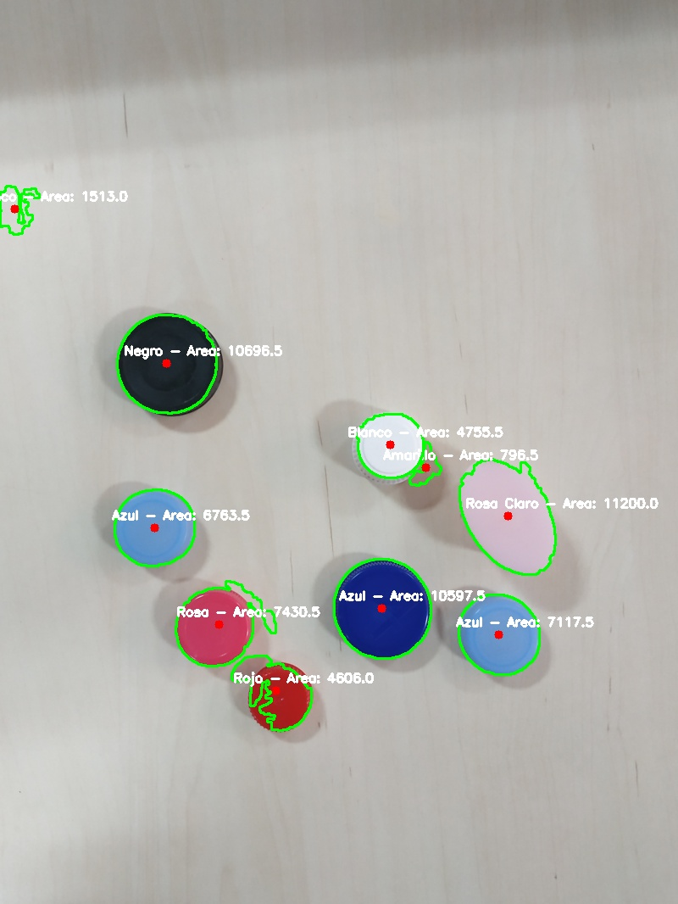
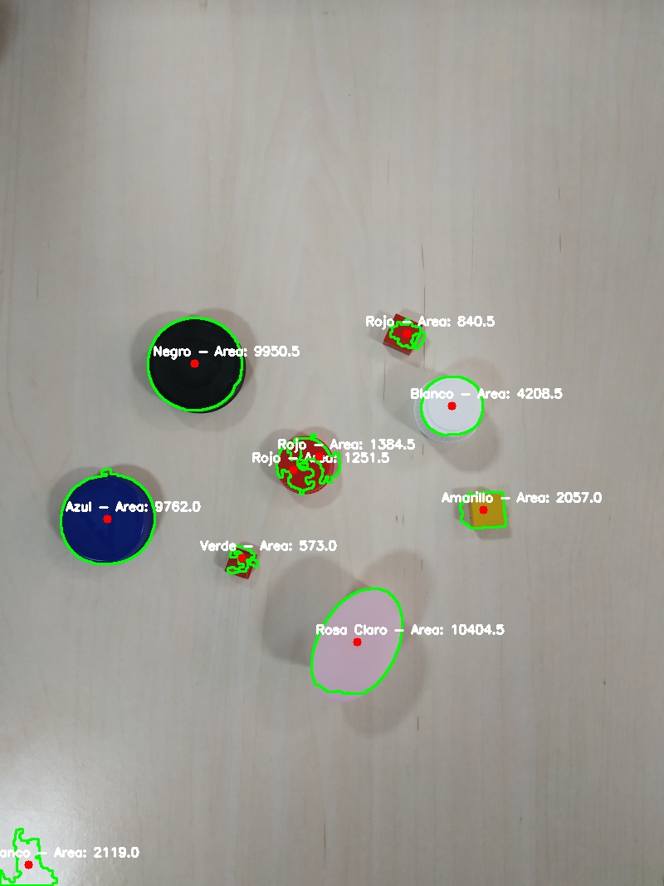

# 🎯 **Detector de Tapones Multicolor** 

¡Bienvenido al **Detector de Tapones Multicolor**! Este proyecto utiliza técnicas de procesamiento de imágenes con **OpenCV** para detectar y clasificar tapones en imágenes 📸, ¡y lo hace de manera rápida, precisa y colorida! 

                         

---
##  **Características** 🛠️


-  **Detección Multicolor**: Identifica tapones de distintos colores utilizando rangos ajustados en el espacio de color HSV.
-  **Mejora de Iluminación**: Utiliza el algoritmo **CLAHE** (Contrast Limited Adaptive Histogram Equalization) para mejorar el contraste y visibilidad en las imágenes.
-  **Filtrado por Área**: Elimina tapones demasiado pequeños para evitar falsos positivos, garantizando una detección precisa.💡
-  **Segmentación de Imágenes**: Crea imágenes segmentadas donde los tapones se destacan para un análisis más detallado.
-  **Visualización**: Muestra los resultados con contornos, áreas y colores de tapones identificados directamente sobre la imagen.👁️
-  **Configuración Personalizada**: Ajusta parámetros como rangos de colores y directorios de entrada/salida según tus necesidades.

---

## 📦 **Requisitos** 

Para que este proyecto funcione correctamente, necesitas instalar algunas dependencias:

- **OpenCV** (`opencv-python`) 📸: Para el procesamiento de imágenes.
- **NumPy** (`numpy`) ➗: Para operaciones matemáticas y manejo de matrices.
- **imutils** (`imutils`) 💻: Para simplificar operaciones de procesamiento de imágenes.

---

## 📥 **Instalación** 📂

Sigue estos pasos para instalar y configurar el proyecto:

1. **Clona el repositorio**:

    ```bash
    git clone https://github.com/tu-usuario/DetectorTaponesMulticolor.git
    ```

2. **Accede a la carpeta del proyecto**:

    ```bash
    cd DetectorTaponesMulticolor
    ```

3. **Crea un entorno virtual** (opcional, pero recomendado):

    ```bash
    python -m venv venv
    source venv/bin/activate   # En Linux/Mac
    venv\Scripts\activate      # En Windows
    ```

4. **Instala las dependencias**:

    ```bash
    pip install -r requirements.txt
    ```

---

## 🏁 **Uso del Proyecto** 🚀

1. **Añade las imágenes que deseas procesar** en la carpeta `imagenes_tapon/` dentro del proyecto. 📂
   
2. **Ejecuta el script de detección**:

    ```bash
    python DetectorTaponesMulticolor.py
    ```

3. ¡Eso es todo! Las imágenes procesadas se guardarán automáticamente en la carpeta `imagenes_tapon_detectados/` con los tapones destacados. 🖼️

---

## **Colores Detectados** 🎨

Este proyecto puede identificar los siguientes colores:

- 🔵 **Azul**
- 🟢 **Verde**
- 🔴 **Rojo** (Rango 1 y 2)
- 🟡 **Amarillo**
- ⚫ **Negro**
- 🌸 **Rosa**
- 🌷 **Rosa Claro**
- 🔵 **Azul Claro**
- ⚪ **Blanco**

---

## 🧑‍💻 **Contribuye al Proyecto** 💡

¿Tienes una mejora en mente o alguna idea brillante para el proyecto? ¡Nos encantaría escucharte! 🎤💬

Si encuentras un error o deseas añadir nuevas funcionalidades, no dudes en **abrir un issue** o **hacer un pull request**. ¡Todos los aportes son bienvenidos! 🙌

---

## **Licencia** 📜

Este proyecto está bajo la **Licencia MIT**. Puedes consultar los detalles de la licencia en el archivo [LICENSE](LICENSE).

---

## 📸 **Ejemplos de Imágenes Procesadas** 🖼️

Aquí tienes algunos ejemplos de cómo se verán las imágenes después de la detección:




---
